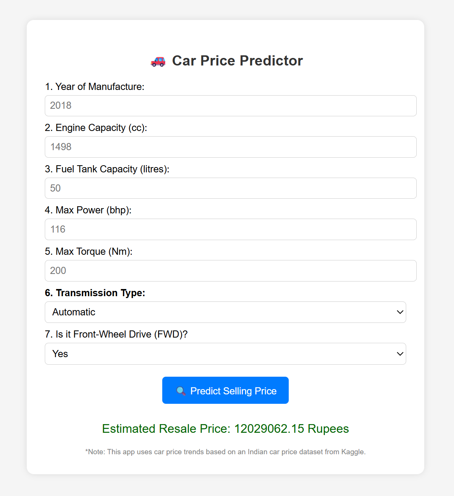

# Car Price Prediction Regression Model
Dataset obtained from: https://www.kaggle.com/datasets/nehalbirla/vehicle-dataset-from-cardekho

"Car Price Prediction.ipynb" contains the following:
1. Data exploration and cleaning
2. Feature engineering
3. Fitting and comparison of three different regression models
4. Saving model into .pkl file

"mainapp.py" contains the code used to deploy the model through a Flask app to predict car prices:

